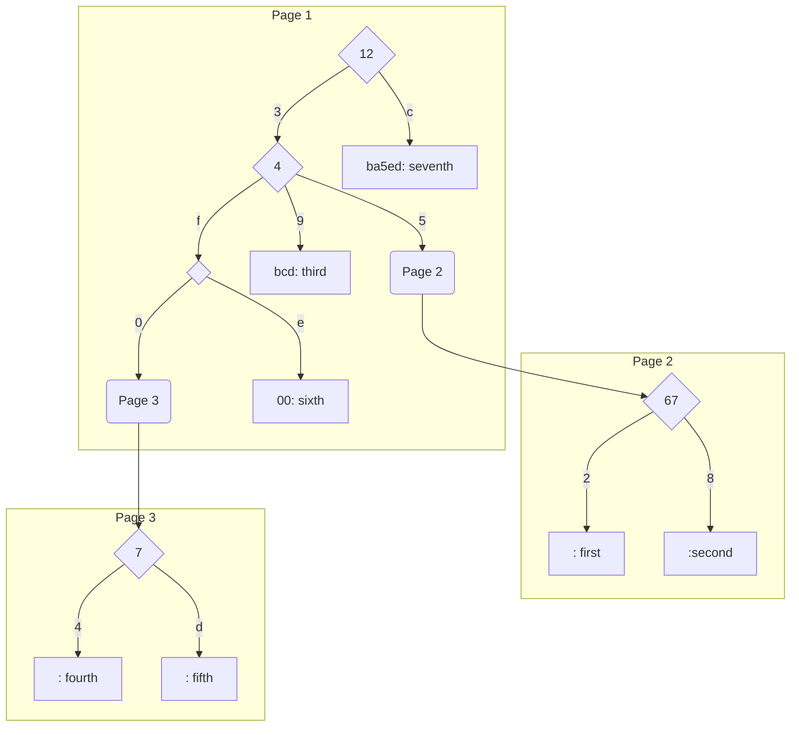
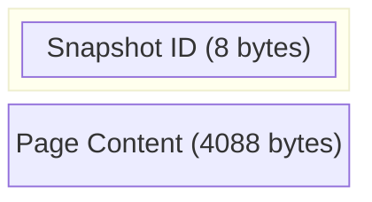
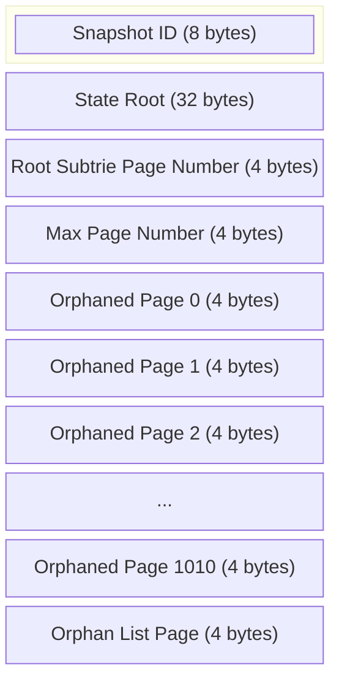
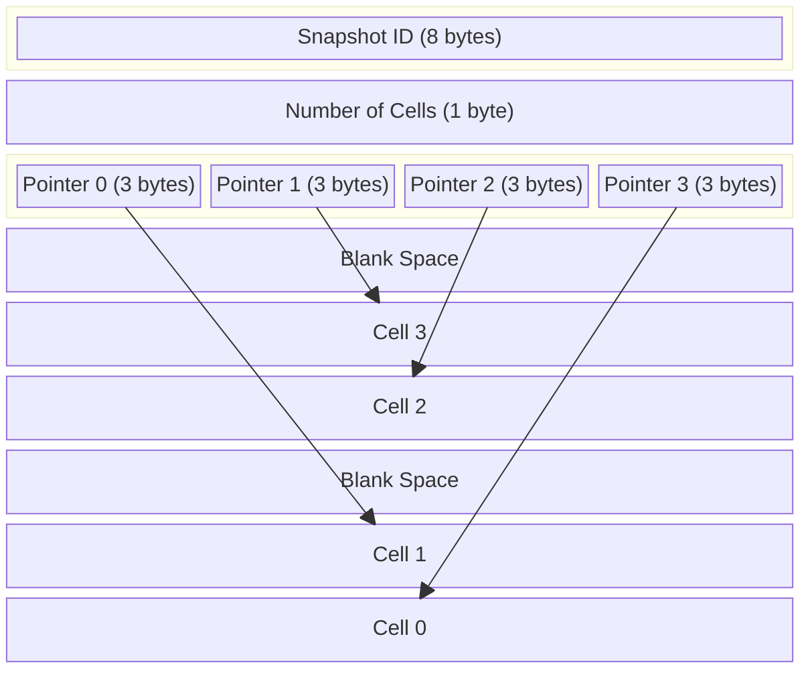
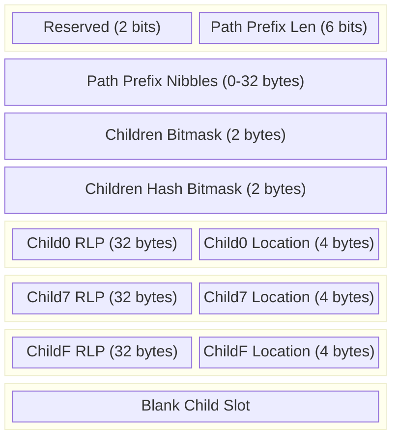
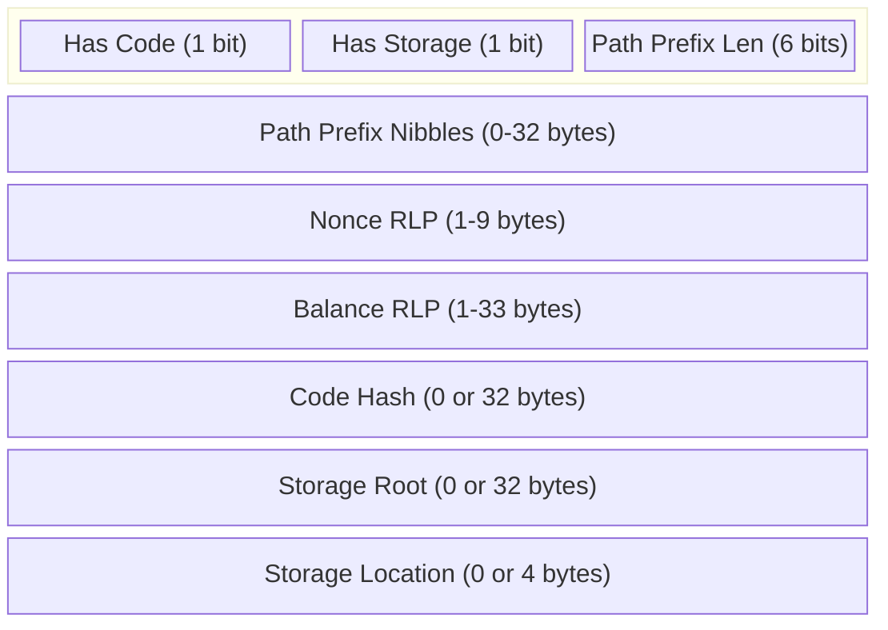
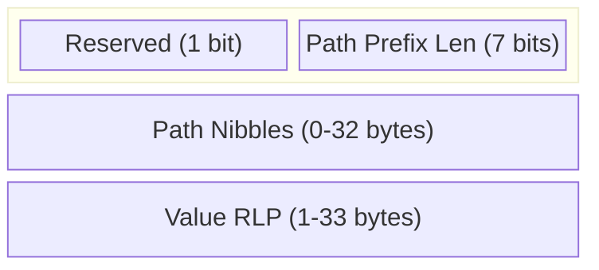
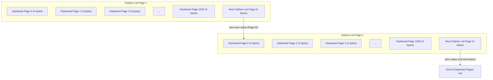

# TrieDB (TBD)

A database for the Ethereum state trie.

## Overview

TBD is an embedded database which supports reading and writing Accounts as well as Storage values in atomic transactions (typically corresponding to a single block). The primary objective of this storage format is to minimize sequential disk access latency during block processing, in 2 stages:
- Reading Account and Storage values while executing EVM transactions,
- Writing Trie updates, including computation of the State Root, upon completion of the block.

This new database design is intended to replace the traditional generic Key/Value stores typically used in EL clients, including LSM-tree databases such as LevelDB (used by geth) and B-tree databases such as MDBX (used by Reth), specifically for persisting the EVM State Trie. While these other Key/Value databases are highly tuned and extremely performant for reading and writing arbitrary unstructured data, this is a suboptimal mechanism for persisting a highly structured data structure such as the Ethereum State Trie. While traversing the trie from Root to Leaf in order to read a single value is predicted to scale logarithmically with the size of the trie (`O(log N)`), this is also the cost associated with accessing each item stored in a Key/Value database. In effect, the database must be fully searched for each independent trie node, and this work must be repeated until a Leaf node is found, resulting in a true scaling factor of `O(log N * log N)`. In practical terms with the scale of chains such as Ethereum or Base, we may expect traversal of the State Trie to require on the order of ~50 disk operations in order to read or write a single value (Account or Storage Slot), although reads and writes to higher portions of the trie may be trivially deduplicated when processing a batch of Trie accesses, as is typically the case for EVM block execution.

Instead of treating each item in the database as unique and unrelated, we instead choose to arrange the data on disk based on the structure of the Trie. Related nodes (Subtries) are grouped together into a series of Pages, and finding the child of a Node only requires following a pointer to the next Page containing it. This may require reading or writing to a “random” section of the disk, but we assume that colocation beyond the Page size is not critical to modern solid state storage. Instead of the `O(log N * log N)` scaling behavior of using a traditional Key/Value storage to persist the Trie, we expect that this storage layout will instead scale at the theoretical optimal `O(log N)`. In practice, this should reduce the cost of accessing a single value from ~50 disk operations down to ~8. By packing together multiple layers of the trie onto the same Page, this may even be further reduced to as low as ~4 operations, resulting in around a 10x increase in bandwidth and reduction in latency for storage-related workloads. Further optimizations such as omitting top levels of the Trie from persistent storage may also be possible, at the cost of higher complexity, memory usage, and startup time.

In order to support simultaneous reads and writes, enabling parallel EVM execution as well as state reads in tandem with block execution, this database achieves Multiversion Concurrency Control (MVCC) via a Copy on Write scheme. Updates to disk are performed by copying the contents of existing Pages to unused (“orphaned”) or newly-allocated Pages, and only updating the root pointer after these changes have been persisted. By reserving the first two pages of the disk as Root Pages, we can ensure that the database state will always be consistent after the latest fsync, with the latest root identified by selecting the Root Page with the greater version number. This approach allows for a single writer (sufficient even for parallel EVM execution), multiple concurrent readers, and strong consistency without the need for a Write Ahead Log (WAL). In a Tree-structured database with a Copy On Write scheme, modifying a Leaf node typically results in write amplification as it requires updating all of its ancestors, including the root node. However, in the case of the Ethereum MPT (Merkle Patricia Trie), which uses a recursive hashing scheme, this write amplification has minimal impact because any modification to a subtrie in the MPT causes changes to the hash of all its ancestors, including the Root, requiring these ancestor Pages to be rewritten regardless. Notably, the use of Copy On Write requires that unreferenced pages be intentionally reclaimed in order to prevent the storage requirements from growing much faster than active state size.

## Storage Layout

*Example shown below holding the following (8 nibble) key/value pairs for illustrative purposes:
12345672: first, 12345678: second, 12349bcd: third, 1234f074: fourth, 1234f07d: fifth, 1234fe00: sixth, 12cba5ed: seventh*

While the MPT structure is formally designed for arbitrary path/value data storage, there are specific optimizations which may be made when focusing solely on the State Trie. In particular, all Accounts will have a 32 byte path (64 nibbles), meaning that Branch nodes will never actually store any data within the Account portion of the trie. All Accounts must be stored in Pseudo-Leaf nodes instead (these may contain a reference to a Storage Trie Root). A similar behavior can be noted within each Storage Trie, as each Storage slot is mapping from a 32 byte key to a 32 byte value. This is valuable information when designing a Page format. If each Account is addressed by a 32 byte path and each Storage slot is addressed by a 64 byte path, then we also can imply the type of a node simply by the length of its path (32: Account, 64: Storage, Other: Branch) or automatically determine the length of the path for any Leaf (Account or Storage) node.

All data in this database is broken down into 4KB Pages, the minimal unit of disk IO on modern SSDs. Pages may reference each other in a strictly hierarchical structure (no cycles), which allows old Pages to simply become orphaned and later recycled after each commit. In order to reduce the overhead associated with copying and modifying Pages, we aim to minimize unnecessary serialization/deserialization. This is achieved by utilizing a Slotted Page format, with a list of ordered Pointers at the beginning of each Page which refers to a sequence of Cells which are written backwards from the end of the Page. Updating a Page may only require modifying a single Cell’s contents, even when the size of the Cell’s Trie Node changes.

Although the state root of the MPT is formally defined based on the RLP encoding of Nodes, this is an inefficient use of state. Instead we will utilize custom encoding formats specific to Branches, Accounts, and Storage slots which can be more efficiently compressed on disk, while only using RLP for hash computation.

In addition to using Pages to store data (Trie Nodes), we will also need to keep track of orphaned Pages. This is tracked using a standard on-disk list format which also leverages Copy-on-Write, which has the side effect that updating the orphaned Pages set will always create new orphaned Pages.

### Page Layout

Database is broken down in to pages, each page has 4 KB size.
* Header
  * Snapshot ID (8 bytes)
    * This is the Version when page is created.
* Page content (4088 bytes)
  * This is ether root page or subtrie page.

### Root Page

Pages 0 and 1 are reserved for the current and previous Root Pages, which contain database-level metadata.

* Header
  * Snapshot ID (8 bytes)
    * This is an auto-incrementing value, beginning at 1. The larger snapshot id (version) of the two Root Pages denotes the latest version.
* State Root (32 bytes)
  * This is the hash of the root sub-trie, which is the first Node Cell contained within the Page
* Root Subtrie Page Number (4 bytes)
  * This is the numeric location of the Subtrie Page containing the root of the State Trie.
* Max Page Number (4 bytes)
  * Indicates the last Page referenced by this Trie, allowing for truncation upon recovery from an unclean shutdown.
  * An alternative approach would be to include a Version number in each Page. This increases auditability, but this would consume ~0.1% of all storage space instead of this constant value.
* Orphaned Pages List (remainder of Page)
  * This is a 0-terminated list of 4-byte page numbers, each referring to a Page that is “orphaned” as of the Version contained in this Root Page.
  * A non-zero value in the last slot of this Page indicates that the Orphaned Pages List continues at the page number identified by this slot.
  * Note that these Orphaned Pages are expected to NEVER be read from disk after initialization time, so the storage format does not need to be read-optimized.

Note that the number of Root Pages must be a minimum of 2 in order to support MVCC, but we may choose to use a larger value in order to support rapid rollbacks / chain reorgs. In this case, we would likely use a much larger value, such as 128 or 1024. Rolling back from version `V’ -> V` would require nullifying all Root Pages with version greater than `V` and treating all Pages after the Max Page Number as Orphaned.

### Subtrie Page

Pages 256 and greater are used to store the Trie Nodes, with each Page containing a single Subtrie, which may consist of any number of Branch, Account, and Storage nodes.

* Number of Cells (1 byte)
  * This is the number of Cells contained within the Page, with 255 allowing for 16 bytes per (Pointer, Cell) pair.
  * A 0 value here is considered pathological, and indicates that the Page is invalid.
* Pointers (3 bytes each)
  * Higher 12 bits (0-4095) is the Offset from the end of the Page.
  * Lower 12 bits (0-4095) is the Size of the Cell in bytes.
  * A Pointer containg all 0 bits may be treated as a "tombstone" to indicate that the Cell has been deleted.
  * Pointer ordering determines the relative order of Nodes contained with Cells, which allows Nodes to be rearranged quickly without needing to parse or rewrite Cell / Node contents.
* List of Cells, growing backwards from the end of the Page
  * Each Cell contains an encoded Trie Node (Branch, Account, or Storage)

### Branch Node

Due to the exponential decrease in Trie density as deeper portions of the Trie are traversed, we expect the overwhelming majority of Branch nodes to contain a small number of children (2-4) and short prefix (0-4 nibbles), but also expect the top portion of the Trie to primarily consist of nearly-16-child Branches with 0 additional prefix. In order to keep the encoded size of a Branch node relatively stable as individual children are inserted and removed, we choose to use a variable branching factor for the Branch node based on the number of children it contains. Based on the value of the Chilidren Bitmask, the Branch will contain 2, 4, 8, or 16 Child slots in order to only resize the Branch node on each doubling of Child occupancy.

Note that a Branch Node with a non-empty Path Prefix is treated as both an Extension Node and a Branch Node for the purpose of RLP encoding and merkleization, and must be hashed twice.

*Example shown below with only 3 children (0, 7, and F), using a branch width of 4*

* Flags (1 byte)
  * Type (2 bits) - 2 for Branch
  * Path Prefix Length (6 bits) - represents the number of nibbles (0-63) in the Path Prefix.
* Path Prefix Nibbles (0-32 bytes)
  * An odd length prefix will be encoded with a trailing nibble of 0.
* Children Bitmask (2 bytes)
  * Represents the number of children in the Branch node.
  * The most significant bit represents the presence of a child at index 0, the second most significant bit represents the presence of a child at index 1, and so on.
* List of Child Pointers
  * RLP Hash (33 bytes)
  * Location (4 bytes)
    * A 0 value indicates that the child is not present.
    * Values 1-255 are cell indexes on the same Page, while values > 255 refer to the root (index 0) of a Subtrie stored on the identified Page.

### Account Node

* Flags (8 bits)
  * Type (2 bits) - 1 for Account
  * Has Code (1 bit) - 1 if the Account has non-empty code, 0 otherwise
  * Has Storage (1 bit) - 1 if the Account has non-empty storage, 0 otherwise
  * Reserved (4 bits)
* Path Prefix Length (1 byte) - represents the number of nibbles (0-64) in the Path Prefix.
  * The highest bit is reserved for future use, while values > 64 are invalid.
* Path Prefix Nibbles (0-32 bytes)
  * An odd length prefix will be encoded with a trailing nibble of 0.
* Nonce RLP (1-9 bytes)
  * The nonce is stored RLP encoded, which is 1 byte for values 0-127, and 1+n bytes for values in the range (128 - (2^8n)-1)
  * RLP is chosen over other variable-length encoding schemes in order to minimize re-encoding overhead when updating and re-hashing the Account.
* Balance RLP (1-33 bytes)
  * The balance is encoded using RLP encoding, with similar justification as the Nonce.
* Code Hash (0 or 32 bytes)
  * The code hash is stored as a 32 byte value, or absent if the Account has no code.
* Storage Root RLP (0 or 33 bytes)
  * The storage root is stored as a 32 byte value, or absent if the Account has no storage.
* Storage Location (0 or 4 bytes)
  * The storage location is stored as a 4 byte value, or absent if the Account has no storage.
  * As in the Branch Node's Child Pointers, values 1-255 refer to a Storage Cell on the same Page, while values > 255 refer to the root (index 0) of a Subtrie stored on the identified Page.

### Storage Node

* Flags (8 bits)
  * Type (2 bits) - 0 for Storage
  * Reserved (6 bits)
* Path Prefix Length (1 byte) - represents the number of nibbles (0-64) in the Path Prefix.
  * The highest bit is reserved for future use, while values > 64 are invalid.
* Path Prefix Nibbles (0-32 bytes)
  * An odd length prefix will be encoded with a trailing nibble of 0.
* Value RLP (1-33 bytes)
  * The value is stored RLP encoded, with similar justification as the Nonce and Balance.
  * A 0 value (`0x80`) should never be used, as this canonically should be removed from the trie.

### Orphaned Pages List

Orphaned Pages are tracked in a List of Lists, with each 4 byte entry representing the numeric identifier of a Page orphaned as of the current database version. Each Orphan Page contains up to just under 1024 Page Identifiers, as well as a (nullable) reference to the next Orphan Page. A 0 value in either an identifier slot or the NextPage slot can be treated as a null terminator, suggesting that there are no more valid identifiers.

